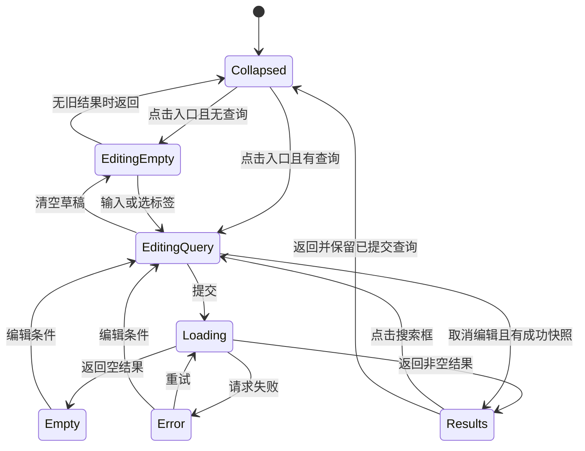

# 搜索全流程功能与 UI/UX 增强方案

基线日期：2026-09-15。Reader 基线提交：`0a9d92f`，勘察开始时工作区干净。

本方案依据本机 Reader、EhViewer 1.14.6、JHenTai 8.0.16 和 LANraragi 0.9.81 源码制定。以下现状表保留规划时基线；2026-09-15 已实施的内容及验证结果见 [实施记录](SEARCH_IMPLEMENTATION_REPORT.md)。没有进行真机交互或服务端运行验证；不能把参考项目的 E-Hentai 搜索语法直接移植到 LANraragi。

## 1. 设计结论

保留现有「图库顶部玻璃胶囊 → 原地展开搜索面 → 面内展示结果」的主结构。借鉴 EhViewer 的入口连续性和联想模型，借鉴 JHenTai 的历史胶囊、原文/译文高亮与输入/结果切换，结合 LANraragi 当前库统计补齐热门标签。

优先顺序是：**查询正确性与状态闭环 → 历史/热门/联想交互 → 结果页一致性与性能 → 精细动效和快捷能力**。仅调整圆角、透明度或标签排列无法解决当前搜索链路中的语义问题。

具体决策：

- 只保留一个搜索入口和一个搜索会话，不恢复独立「标签浏览」页。
- 输入只更新草稿与本地联想；明确提交后才改变图库查询。
- 历史点击立即重搜；标签点击填入条件并继续编辑；所有非空输入始终有明确的「搜索」动作。
- 搜索结果复用图库内容组件、数据协调器和操作规则；搜索面只提供不同的容器与标题区。
- 热门标签表示「当前库高频标签」，不表示全站趋势、个人搜索次数或当前分类内热度。
- 搜索面不增加第二套排序/筛选表单；结果区只显示已生效条件摘要，并可打开已有筛选面板。

## 2. 当前代码现状与主要缺口

以下定位见文末源码索引。

| 环节 | 已具备 | 缺口与影响 | 优先级 |
| --- | --- | --- | --- |
| 搜索入口 | 48dp 玻璃胶囊，左侧独立筛选按钮，当前查询展示与清除 | 收起态和展开态为两棵独立 UI；浮层 `if (!expanded) return`，没有覆盖开合全过程的几何过渡 | P1 |
| 展开面 | 返回、输入、清除、焦点请求、IME padding、隐藏底栏 | 未接搜索专属 BackHandler；提交未显式收起键盘；恢复结果态仍可能触发焦点请求 | P0 |
| 历史 | DataStore 最近优先、去重、20 条；点击搜索、管理删除、隐藏、清空 | 默认铺满；输入时不筛选历史；隐藏不持久；直接清空；读后写不在同一 edit 内，存在并发覆盖风险 | P1 |
| 热门标签 | 服务端统计，降序、命名空间切换、过滤部分机器标签、最多 60 个 | 无加载/失败/无标签区分；只在当前组合中缓存；缓存没有服务器键；无频次/来源说明；没有本地来源策略 | P1 |
| 标签联想 | 220ms 防抖、FTS/词库查询、namespace 颜色与译名、点击包含/长按排除 | 将整段查询交给候选排序；未按光标 token 补全；候选转换为 TagStat 丢失匹配质量与个人频次；有候选时不显示直接搜索行 | P0/P1 |
| 标签插入 | 当前在字符串末尾拼接条件 | 生成 `namespace:"value$`，引号位置/闭合不符合服务端；无 namespace 标签也按冒号拆分；不替换半截输入 | P0 |
| 查询执行 | LibraryQuery、统一请求协调器、generation 防旧响应覆盖 | 远端已筛选条目再次按完整 `q.text` 做 contains，会误排除带逗号、排除符和精确符的合法结果 | P0 |
| 数据分页 | UI loadMore、去重和请求取消 | remote.fetch 先取尽全部结果；每次 MixedLibraryRepository.load 再抓取/合并/排序/切片，大库首屏和后续页成本高 | P0 勘察/P1 优化 |
| 结果计数 | 数据层有 total | 搜索面显示 `state.items.size`；JSON 解析优先 recordsTotal 而非 recordsFiltered；需从契约到 UI 一起校正 | P0 |
| 结果展示 | 使用 ArchiveCard、共享 LibraryState、点击打开、长按进入选择 | 独立网格未复用图库完整视图模式、加载/错误/空态；固定 selectionMode=false、isSelected=false；与长按进入多选相冲突 | P0 |
| 结果续页 | snapshotFlow 监听尾项 | effect 仅以 gridState 为 key，闭包读取初次 state，存在陈旧分页条件风险 | P0 |
| 返回恢复 | 草稿与展开布尔值 rememberSaveable | 没有显式区分编辑前结果与编辑草稿；结果子树移除后滚动恢复没有按查询定义；缺少完整返回约定 | P0 |

### 2.1 必须先解决的语义问题

LANraragi `compute_search_filter` 按逗号分条件，开头 `-` 表示排除，**条件开头**的双引号或条件末尾 `$` 表示精确匹配；`?/_` 和 `*/%` 是通配符。它没有实现 E-Hentai 的 `~` OR 语义。项目现有 TagQueryParser 的 `FUZZY` 只是词库候选匹配概念，也不能据此宣称服务器支持模糊运算符。

应统一生成如 `artist:sample creator$`、`-language:english$` 的 LANraragi 条件，或给整个条件加引号：`"artist:sample creator"`。不能生成 E-Hentai 的 `artist:"sample creator$"`，更不能保留当前缺少末尾引号的格式。值中有特殊符号时必须由统一序列化器处理；现有服务端未提供通用转义保证，不能简单声称加反斜杠即可精确搜索任意标签。

同时修复第二次过滤：例如服务端已按 `language:chinese$,artist:sample$` 找到条目，客户端不应要求该条目的标题/标签中包含这一整段字面字符串。分类也应按服务端分类关系判断，不能依赖每个响应对象具有同名 category 字段。

## 3. 参考项目的取舍

| 来源 | 源码确认的能力 | 本项目采用方式 |
| --- | --- | --- |
| EhViewer SearchBarScreen | Material SearchBar 的 expanded 状态、TextFieldState、collectLatest 联想、历史与标签合并、历史点击回填 | 采用统一开合状态、明确的候选类型和过期任务取消；保留 Reader 玻璃风格与结果内嵌布局 |
| EhViewer TagSuggestion | 根据末尾分隔符定位输入片段，并替换末段 | 借鉴片段替换，但进一步支持光标在中间时替换当前 token；重写 LANraragi 序列化 |
| EhViewer 提交 | 修整输入、记录历史，再执行搜索；搜索栏收起后显示内容 | 借鉴单一提交入口；Reader 提交后留在搜索面展示结果 |
| JHenTai SearchPageMixin | 历史胶囊、译名显示、点击重搜、长按插入历史、管理模式 | 采用历史胶囊和译名；把「编辑后搜索」做成可见菜单动作，减少隐蔽手势 |
| JHenTai 联想 | 原文/译文匹配高亮、matchStart 替换、输入后隐藏历史、300ms 防抖 | 采用双语高亮与输入时内容收敛；不照搬始终将光标放末尾或截掉后半段的行为 |
| JHenTai 提交与 bodyType | 提交 unfocus、切换为 galleries；点击搜索框返回 suggestionAndHistory | 采用明确的编辑/结果状态与键盘收起规则 |
| JHenTai 词频服务 | 外部标签 count 数据与排序优化；历史上限 50 | 词频仅辅助候选排序；保留当前 20 条历史容量，先优化展示与可靠性 |
| Reader + LANraragi stats | 当前库标签与 weight | 用作热门标签的实际来源；本次检查的两款参考搜索组件不能作为「已有同样热榜」的证据 |

图搜、E-H gallery URL 直达、E-H 专用过滤项不纳入本期通用搜索，它们需要独立能力和服务端支持。

## 4. 用户可见的全流程

### 4.1 收起态：看得出能搜索，也看得出当前条件

继续使用 48dp 高胶囊，左侧筛选按钮保持独立 48dp 触区；用细分隔或间距明确它与搜索区的边界。搜索区域显示图标和「搜索标题或标签…」，有已提交查询时显示可读摘要并尾部省略。语义中读出完整查询。

清除按钮只清除搜索条件，保留来源、分类和排序。清除后刷新当前范围，不自动弹键盘。筛选条件不为空时在筛选图标显示小圆点；不把每个条件都塞进收起胶囊。

点击文本或搜索图标使用同一路径展开。收起态不是可编辑 TextField，避免先聚焦旧框再跳到新框。

### 4.2 展开：入口连续、焦点稳定

手机展开为覆盖内容区的搜索面；横向位置、输入基线、圆角和背景从胶囊连续过渡。首轮建议 220–280ms，后续依据帧耗时调整；内容轻淡入，不让每个候选反复播放长动画。返回动画保留子树到结束，不能一收起就 return。

展开后顶部固定为 `[返回] [输入框] [清除] [搜索]`。有输入时「搜索」可用；空白时禁用提交，显示探索内容。软键盘搜索、可见按钮、直接搜索行共用同一个提交动作。硬件键盘 Enter 提交、Esc 返回，方向键可移动候选焦点。

从搜索胶囊进入时自动聚焦并展示键盘；由详情返回结果面时不自动聚焦。内容区随 IME 可视高度调整，禁止固定大块底部占位。历史只展示少量行，保证键盘打开时还能看到热门区或首批候选。

浅色主题的输入/内容表面以清晰文字为先；玻璃仅保留在顶栏与过渡边缘。提供普通 surface 降级，尊重减少动画设置。宽屏输入区最大宽度建议 720dp、居中；探索态可左右分历史与热门，结果区保持自适应图库布局。

### 4.3 空输入：历史与热门发现

内容顺序：搜索历史 → 当前库热门标签 → 简短语法帮助入口。

历史默认最多两行，超过时显示「展开全部」。管理操作收敛为一个「管理」入口，进入后才显示逐项删除和清空；避免眼睛、垃圾桶、清空同时抢占标题区。隐藏历史是持久展示偏好；「暂停记录」是独立设置，文案不能暗示隐藏等于停止记录。

点击历史立即提交；长按或菜单提供「编辑后搜索」「复制」「删除」。显示翻译后的摘要，但保存并恢复原始查询；复杂文本省略时可查看完整内容。删除提供撤销，清空二次确认。迁移后历史按服务器/本地作用域分组；旧无作用域记录保留为旧历史，不擅自归属某台服务器。

热门区标题「热门标签」，副文案「按当前服务器库内频次排序」。命名空间用可横向滚动的单选 chips，首项「全部」，名称中文化且保留原名语义，避免多行 namespace 把标签推出首屏。

默认展示 12–18 个标签，提供「更多」或分页；不一次铺 60 个。标签显示译名，详情可查看 canonical 名与频次。namespace 同时使用名称与颜色区分；不依赖颜色表达含义。点击填入精确条件并继续编辑，更多菜单提供「排除」「直接搜索」。选中条件在输入下方显示可删除的小摘要，避免用户不清楚刚刚发生了什么。

热榜不是查询结果预估：全库 weight 不能标为当前分类匹配数。作用域为仅本地时从本地索引统计；混合范围首期仍明确标识「服务器库热门」，不能伪装成合并频次。服务器统计不可用时显示缓存与更新时间；无缓存时显示区域内重试，不影响输入和历史。

### 4.4 输入中：直接搜索优先，联想帮助构造条件

有非空输入时固定显示第一行「搜索『当前输入』」，之后为最多 3 条匹配历史，再为最多 12 条标签候选，可扩展查看更多。隐藏热门区和完整历史，避免输入后还要越过大量无关内容。

候选行采用原文/译文两行或按语言偏好调换主次，突出匹配片段，显示 namespace。频次只有来源明确时才显示；全站 count 不能写成「本库 N 本」。翻译缺失时显示原文；无 namespace 时不展示多余冒号。

补全只使用光标所在片段，例如 `language:chinese$,art` 的候选来自 `art`；选择作者后只替换该片段，保留前后条件、选择区和排除修饰符。用户输入 `-art` 时仍能联想作者，选中后生成排除条件；不能用「排除候选本身」的词库查询方式完成这个交互。

使用能保存 selection/composition 的输入状态。中文 IME 组词期间不重写文本、不抢焦点、不触发网络结果搜索。联想延续约 220ms 的本地防抖，采用 latest-wins；清空、关闭面板、切服务器时立即使旧候选失效。旧候选若暂时保留，也不能再以新输入的身份被点击。

无词库时仍可搜索任意文本，并用当前库标签缓存提供基础英文候选；中文翻译补全显示词库设置入口。词库查询失败与「无匹配候选」分开表示，不能把全部异常吞成空列表。

默认查询文字查标题/标签，中文标题直接按原文搜索；中文标签通过选中候选转换 canonical 值。不要静默把所有中文自然语言改为某个标签。第一期不承诺拼音、语义搜索或摘要全文检索。

### 4.5 提交：一次提交对应一个结果会话

点击搜索：验证/序列化 → 原子更新已提交查询与请求 generation → 收键盘/清焦点 → 展示加载状态 → 异步记历史。历史写入失败不能阻止结果请求。

重复点击不并发提交相同在途查询；已完成同查询可明确执行刷新。空白只清草稿，不通过空查询提交误清分类。选择标签不自动请求结果，除非用户选择「直接搜索」。

保留查询摘要和当前分类/来源/筛选 chips。改变草稿不改变已提交结果；取消编辑可回到上一次结果。没有上一次结果时，取消关闭搜索面，图库保持原先查询。

### 4.6 结果：查询、数量、内容和操作保持一致

结果头建议两行：第一行 `共 N 项 · 已加载 M 项`，第二行简短范围摘要。N 未知时只显示 `已加载 M 项`；请求中显示「搜索中」，不能先展示上一查询的 N 或临时 0。使用「项」兼容单行本分组，不能把所有条目都叫独立本数。

复用图库 grid/list/compact、自适应列数、封面比例、标题偏好、缓存/收藏/进度标记及来源身份。点击普通档案打开详情或既有目标；单行本走成员入口；本地项继续走本地打开路径。长按多选必须同时展示选中态与已有批量动作，并遵循 capability 门禁。

| 状态 | 表现与动作 |
| --- | --- |
| 首次加载 | 保留输入与范围摘要，内容显示稳定骨架或进度；禁止把旧结果标为新查询 |
| 有结果 | 复用图库组件；支持返回顶部和当前查询刷新 |
| 成功无结果 | 「未找到匹配项」，提供编辑关键词、移除某条件、清除搜索；不能自动放宽条件 |
| 首次失败 | 显示网络/鉴权/服务端错误及重试；保留草稿与已提交条件 |
| 追加加载 | 内容保留，底部加载状态 |
| 追加失败 | 内容保留，底部重试；重试同一 offset，不跳页 |
| 无更多 | 简短终点提示，不继续触发请求 |
| 混合来源部分失败 | 分别显示本地可用结果与远端失败提示；计数标记不完整，提供重试远端 |

结果返回规则：从详情/阅读器回来，恢复同 query key 的列表位置；点击结果页输入框进入编辑态，保留结果快照。搜索面关闭后，图库保留最后一次已提交查询；编辑草稿被取消，不偷偷生效。要回全部内容使用明确清除动作。

### 4.7 返回与清除的统一规则

| 操作 | 行为 |
| --- | --- |
| 系统返回，IME 可见 | 先关闭键盘，不改变查询 |
| 系统返回，历史管理中 | 退出管理模式 |
| 系统返回，多选中 | 退出多选；忙碌批操作按已有规则处理 |
| 系统返回，编辑中且有旧结果 | 放弃本次草稿，回旧结果 |
| 系统返回，编辑中且无旧结果 | 关闭搜索面 |
| 系统返回，结果中 | 关闭搜索面，图库继续显示已提交结果 |
| 顶部返回按钮 | 执行对应页面返回动作并收键盘，不要求再点一次按钮收键盘 |
| 编辑框清除 | 仅清草稿，展示历史/热门；已提交查询直到下一步明确动作才改变 |
| 收起胶囊清除/结果「清除搜索」 | 清已提交文字及由搜索编辑器产生的条件，保留非搜索范围条件，刷新 |

管理与多选互斥；模态对话框优先消耗返回。退出搜索后恢复底栏，底层列表在覆盖期间不接受点击或滚动。

## 5. 状态与组件落地

图中是主路径；取消编辑应恢复先前实际结果状态（包括 Empty/Error），不是一律恢复成功结果。键盘、管理模式、选择模式作为独立子状态处理，不扩散为更多任意布尔组合。

### 5.1 状态所有权

- 页面级 `SearchUiState` 由 LibraryViewModel 或其页面级搜索状态持有者维护：phase、draft（文字/selection）、编辑前快照标识、已提交 query key、联想状态、热门 namespace、历史展开偏好。
- IME composition、FocusRequester 等 UI 对象留在 Compose，恢复文字和选区，不持久化活跃组词会话。
- 已提交条件继续使用 LibraryQuery，网络结果继续由 LibraryRequestCoordinator 独占。UI 状态只引用结果 generation/query key，不保存第二套可变档案列表。
- 搜索面与图库通过同一 `LibraryResultsContent` 展示同一结果；滚动状态按 query key 复用。输入/结果切换时状态持有者不随子树销毁。
- 库页内部提交直接调用 VM，不绕 SearchBus；跨入口总线暂保兼容，最终转成显式动作，避免 null 清空式事件消费影响提交时序。

### 5.2 查询模型与本地/远端边界

新增/收敛 `SearchQueryCodec`（建议名）：解析逗号条件、精确/排除/通配符，定位光标 token、替换 token、产生显示摘要和 LANraragi filter。已存在 TagQueryParser 专用于词库检索，不能未经兼容测试当作服务器语法解析器。

保留原始查询以支持编辑和兼容历史。canonical 化用于已识别标签与语义键，不对任意标题做破坏性 Unicode/空白重写。去重按已解析条件处理；同一标签同时包含和排除时提供替换操作，不悄悄搜索一个永远为空的交集。

远端搜索、分类成员资格和服务端支持的过滤由服务器负责；客户端只补充真正属于客户端的 capability/保存状态等限制。本地来源实现明确的兼容查询评估器，第一期覆盖标题/标签、AND、排除、精确和通配符。暂不支持的语法必须显示能力提示，不能退回整串 contains 假装支持。摘要搜索若未来加入，需独立条件和来源能力说明。

当前 `LibraryViewModel.refresh()` 仍把 source 固定为 ALL，虽然 LibraryQuery 已定义 REMOTE/LOCAL。上述来源策略是待接线能力：S1 将来源纳入唯一查询状态，并由现有筛选面板选择，不在搜索面增加第二套来源控件。未接入前不能把「仅本地搜索」列为已支持。

`JsonHelpers.parseArchiveList` 的调用者包括图库统计等场景，不宜盲目交换一个优先级了事：搜索响应应同时保存 matchedTotal 与 libraryTotal，让搜索计数/分页使用 recordsFiltered，统计卡使用 recordsTotal。混合结果总数只有去重与本地条件完成后才能确定。

### 5.3 分页与性能

先给现有路径加请求次数/首屏时延基线，随后分步替换：

1. 过渡修复：同 query generation 内缓存已合并快照，追加页只切片，不重复全量请求；设置内存边界与失效条件。该步骤不等于首屏性能已解决。
2. 仅远端：使用服务器 offset 真分页，优先响应首屏；next offset 按实际返回数量递增，保留服务端顺序和分组语义。
3. 仅本地：本地数据库条件/排序/分页，避免每个候选逐项 metadata 查询放大 IO。
4. 混合来源：改为查询会话中的两个来源游标与稳定合并；只在两端可表达同一排序键时保证全局混排。无法保证时明确分来源展示，不能以局部排序伪装全局顺序。

query key 包括服务器身份、来源、全部筛选、排序和分组策略。刷新创建新 generation，旧页不得追加；视图模式改变不应触发等价数据的重复网络加载。底层图库与搜索结果仅一个活跃滚动观察者触发 loadMore，协调器继续兜底去重和互斥。

### 5.4 热门与联想数据

热门缓存键包含 server scope；后台更新而不阻塞输入，初始 TTL 可取 30 分钟，标签/元数据变更后失效。来源切换取消旧请求，保留各自缓存。namespace canonical 化后筛选；机器 namespace 排除集中维护，并纳入 source、时间类等配置策略。

联想保留 TagSuggestion 类型或专门 UI 模型，不压成 TagStat。建议排序：当前片段精确匹配 → 原文/译名前缀 → 包含；同档位再考虑当前库存在、个人选择频次和全局频次，最后用 canonical key 稳定排序。本库命中不得把明显更差的文本匹配挤到前面。

仅传当前 token 给候选引擎，并单独保留操作符；不用已输入的多个独立标签共同过滤一个候选。为 FTS miss 的全词库回退设置规模上限与性能预算，取消异常原样抛出。个人频次只在实际采用候选/提交条件时记一次，不在每次展示候选时增加。

## 6. 开发任务与验收门槛

| 批次 | 任务 | 主要文件/建议拆分 | 验收门槛 |
| --- | --- | --- | --- |
| S0 / P0 | 语法编解码、光标片段、无 namespace/排除修复 | 新 SearchQueryCodec；LibrarySearchOverlay；TagQuery 适配边界 | 点选标签能生成服务端可识别条件；中间替换不丢尾部；不把 E-H 格式直接发送 |
| S1 / P0，依赖 S0 | 来源过滤归属、计数、分类语义与请求身份 | LibraryCatalog、LibraryGatewayAdapters、LibraryQuery、JsonHelpers、LibraryRequestCoordinator | 远端正确结果不被字面二次过滤；总数与已加载数区分；快速 A→B 不串结果 |
| S2 / P0，依赖 S0/S1 | 草稿/已提交状态、返回/IME、复用结果容器与多选 | LibraryScreen、LibrarySearchOverlay；提取 LibraryResultsContent | 所有结果状态可见；三种视图与图库一致；返回详情保位置；多选有反馈 |
| S3 / P1，依赖 S2 | 历史管理、热门缓存、双语联想与显式搜索 | SearchHistoryRepository；热门数据仓库；TagKnowledgeQueryFacade；搜索子组件 | 键盘打开可见有用内容；离线不阻断搜索；无词库能用；不跨服务器串热门 |
| S4 / P1，可在 S1 后单独推进 | 真分页、混合来源策略与大库性能 | catalog 数据层、分页契约与测试 | 仅远端首屏无需取尽数据；追加不全量重抓；排序/去重/总数口径可靠 |
| S5 / P2，依赖 S2/S3 | 连续开合、宽屏、无障碍、快捷操作与预设入口优化 | LiquidGlassSearchBar、搜索容器、现有 FilterSheet/预设入口 | 动效无跳位、无底层误触、大字体不裁切；键盘与读屏可完成全流程 |

最小可发布闭环为 S0–S3；大库发布前同时要求 S4 通过性能验收。不要先把 S5 包装成搜索完成。预设继续复用既有实现，不另起搜索收藏数据库。

### 6.1 自动验证清单（实施时补充）

| 层级 | 必测场景 |
| --- | --- |
| 编解码/服务端契约 | `artist:sample$`、`-language:english$`、`"artist:sample creator"`、无 namespace 标签、逗号 AND、通配符、引号未闭合、保留字；unsupported `~` 有明确处理 |
| token 编辑 | 光标头/中/尾、选区替换、多词标签、中文 IME composition、负号保留、连续点选去重、包含/排除冲突 |
| 来源与计数 | 远端已匹配项不会被再次 contains 排掉；recordsFiltered=42、recordsTotal=1000、loaded=30 时显示共 42 项；动态分类不靠响应 category 字段重判 |
| 请求协调 | A 请求慢于 B；关闭/重开；服务器切换；重复提交；追加失败重试；refresh 与 loadMore 交错；取消不变错误 |
| 历史与缓存 | 原子并发写、容量 20、提交去重、删除撤销、清空确认、旧历史迁移、服务器作用域、TTL 与显式失效 |
| Compose | 永久可见的提交入口；返回优先级；成功空与失败区分；恢复结果不唤起键盘；编辑取消回旧结果；多选与视图切换 |

复用现有 LibraryQueryTest、TagQueryAndRankingTest、LibraryRemoteGatewayGateTest 等测试入口；对新语义增加独立契约样例，不能只测试序列化器自己解自己的字符串。

### 6.2 真机与性能验收

- 360dp 窄屏、横屏/平板、深浅色、放大字体、中文输入法、硬件键盘与读屏。
- 冷启动展开、词库未安装/损坏、无标签库、服务器切换、离线/超时/鉴权失败。
- 搜索 → 详情 → 阅读 → 返回；输入草稿时旋转/后台恢复；追加失败后重试；底栏与底层手势无穿透。
- 历史/tag 可见胶囊可做紧凑视觉，但独立有效触区以 48dp 为目标，不能靠重叠扩展区域制造误触。
- 记录 1k/10k 级档案库与大词库的首屏时延、请求次数、候选 p95、内存峰值。建议目标：输入反馈下一帧可见，本地候选计算 p95 ≤100ms（不含 220ms 防抖）；开合 220–280ms；仅远端首屏默认一个分页请求。目标需在指定设备上测量，不把网络响应时长承诺为固定值。
- 应用代码落地后运行 `:app:assembleDebug` 与相关单元/Compose 测试；当前纯规划交付不运行构建，也不声称上述验收已通过。

## 7. 源码证据索引

以下为本次读取的本地源码；行号对应上述基线，后续修改可能漂移。

### Reader

- [搜索入口、热门与联想状态](/D:/program/lanraragi-reader-merged/app/src/main/java/com/lanraragi/reader/ui/screens/LibraryScreen.kt:1564)
- [提交、追加标签和结果接线](/D:/program/lanraragi-reader-merged/app/src/main/java/com/lanraragi/reader/ui/screens/LibraryScreen.kt:2217)
- [独立结果网格与分页观察](/D:/program/lanraragi-reader-merged/app/src/main/java/com/lanraragi/reader/ui/screens/LibraryScreen.kt:3606)
- [搜索浮层 UI](/D:/program/lanraragi-reader-merged/app/src/main/java/com/lanraragi/reader/ui/screens/LibrarySearchOverlay.kt:92)
- [胶囊触区与收起展示](/D:/program/lanraragi-reader-merged/app/src/main/java/com/lanraragi/reader/ui/components/glass/LiquidGlassSearchBar.kt:80)
- [历史存储](/D:/program/lanraragi-reader-merged/app/src/main/java/com/lanraragi/reader/data/SearchHistoryRepository.kt:16)
- [查询模型与远端参数](/D:/program/lanraragi-reader-merged/app/src/main/java/com/lanraragi/reader/data/catalog/LibraryQuery.kt:4)
- [混合来源过滤、排序、切片](/D:/program/lanraragi-reader-merged/app/src/main/java/com/lanraragi/reader/data/catalog/LibraryCatalog.kt:59)
- [远端全量抓取循环](/D:/program/lanraragi-reader-merged/app/src/main/java/com/lanraragi/reader/data/catalog/LibraryGatewayAdapters.kt:13)
- [统一请求 generation 与取消](/D:/program/lanraragi-reader-merged/app/src/main/java/com/lanraragi/reader/data/catalog/LibraryRequestCoordinator.kt:39)
- [结果 total 解析](/D:/program/lanraragi-reader-merged/app/src/main/java/com/lanraragi/reader/data/JsonHelpers.kt:39)
- [词库解析器](/D:/program/lanraragi-reader-merged/app/src/main/java/com/lanraragi/reader/data/tags/knowledge/TagQuery.kt:24)
- [FTS 候选与全库回退](/D:/program/lanraragi-reader-merged/app/src/main/java/com/lanraragi/reader/data/tags/knowledge/TagKnowledgeRepository.kt:15)
- [联想排序及 EXCLUDE 处理](/D:/program/lanraragi-reader-merged/app/src/main/java/com/lanraragi/reader/data/tags/knowledge/TagSuggestionRanker.kt:30)
- [已有总路线图：图库搜索](/D:/program/lanraragi-reader-merged/docs/JHENTAI_ENHANCEMENT_ROADMAP.md:343)
- [已有总路线图：标签补全](/D:/program/lanraragi-reader-merged/docs/JHENTAI_ENHANCEMENT_ROADMAP.md:518)

### EhViewer / JHenTai

- [EhViewer 联想替换与历史合并](/D:/program/EhViewer-1.14.6/EhViewer-1.14.6/app/src/main/kotlin/com/hippo/ehviewer/ui/screen/SearchBarScreen.kt:131)
- [EhViewer SearchBar 展开与提交](/D:/program/EhViewer-1.14.6/EhViewer-1.14.6/app/src/main/kotlin/com/hippo/ehviewer/ui/screen/SearchBarScreen.kt:233)
- [JHenTai 输入、历史与候选 UI](/D:/program/JHenTai-8.0.16/JHenTai-8.0.16/lib/src/pages/search/mixin/search_page_mixin.dart:85)
- [JHenTai 联想替换与高亮](/D:/program/JHenTai-8.0.16/JHenTai-8.0.16/lib/src/pages/search/mixin/search_page_mixin.dart:281)
- [JHenTai 提交、焦点及候选逻辑](/D:/program/JHenTai-8.0.16/JHenTai-8.0.16/lib/src/pages/search/mixin/search_page_logic_mixin.dart)
- [JHenTai 输入/结果状态](/D:/program/JHenTai-8.0.16/JHenTai-8.0.16/lib/src/pages/search/mixin/search_page_state_mixin.dart)
- [JHenTai 历史原文与翻译存储](/D:/program/JHenTai-8.0.16/JHenTai-8.0.16/lib/src/service/search_history_service.dart:12)
- [JHenTai 外部词频服务](/D:/program/JHenTai-8.0.16/JHenTai-8.0.16/lib/src/service/tag_search_order_service.dart)

### LANraragi 服务端

- [搜索语法参数](/D:/program/LANraragi-v.0.9.81/LANraragi-v.0.9.81/tools/openapi.yaml:2007)
- [匹配总数与全库总数](/D:/program/LANraragi-v.0.9.81/LANraragi-v.0.9.81/tools/openapi.yaml:2123)
- [当前库标签统计](/D:/program/LANraragi-v.0.9.81/LANraragi-v.0.9.81/tools/openapi.yaml:2387)
- [实际搜索 token 解析](/D:/program/LANraragi-v.0.9.81/LANraragi-v.0.9.81/lib/LANraragi/Model/Search.pm:388)
